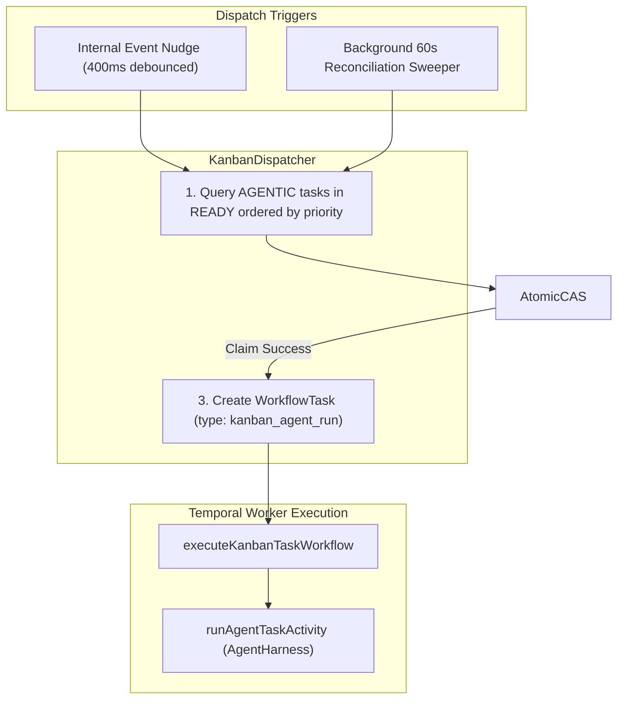

# AI-Native Kanban Phase 2: Autonomous Dispatcher, Temporal Workflows & Model Tools

## 1. Executive Summary & Scope

Phase 2 builds directly upon the database, state machine, and REST APIs established in Phase 1. It delivers the background autonomous execution infrastructure:
- The **`KanbanDispatcher`** with atomic CAS claims (`claimLock`), 60s background sweeper loop, and 5-layer failure circuit breaker.
- The **Temporal Workflows & Activities** in `@shumai/agent` executing task runs against project assets.
- The **Injected Kanban Model Tools** (`kanban_complete`, `kanban_block`, `kanban_comment`, `kanban_create_task`).
- The **Review & Rework Lifecycle** (auto-nudge on change requests, prompt context feeding).
- The **Prompt Caching & Fresh Session Rebuild Architecture**.

---

## 2. Autonomous Dispatcher Engine (`packages/core/src/kanban/kanban-dispatcher.ts`)

### 2.1 Dual-Trigger Dispatch Architecture



1. **Instant Post-Commit Nudge (`autoNudge`)**:
   - Triggered asynchronously after state transitions (`createTask`, `unblockTask`, `requestChanges`).
   - Runs a single dispatcher tick immediately with a 400ms debounce window.
2. **Periodic Background Sweeper (60s loop)**:
   - Evaluates `recomputeReady()` to promote tasks whose `startDate` arrived.
   - Evaluates `reclaimStaleClaims()` to detect dead workers or expired leases.

---

## 3. Failure Model & 5-Layer Retry Architecture

In this system, **`BLOCKED` is the intervention state for failures** rather than a dead-end `FAILED` status. To prevent double-counting and unbounded retries, failures and retries are decoupled across 5 distinct layers:

```
┌─────────────────────────────────────────────────────────────────────────────┐
│ Layer 1: Temporal Activity Retries (IO/Network Layer)                       │
│ - Retries transient S3/DB connection dropouts (max 2 quick retries).        │
│ - All business/LLM errors throw ApplicationFailure(nonRetryable: true).     │
├─────────────────────────────────────────────────────────────────────────────┤
│ Layer 2: Temporal Workflow (Orchestration Layer)                            │
│ - Exactly 1 WorkflowTask execution = 1 KanbanTaskRun.                       │
│ - Catches fatal errors -> invokes kanbanService.recordRunFailure().         │
├─────────────────────────────────────────────────────────────────────────────┤
│ Layer 3: Application Circuit Breaker (consecutiveFailures & maxRetries)     │
│ - Unhandled error/crash increments task.consecutiveFailures += 1.           │
│ - If failures < maxRetries (default 2) ──► Returns to READY (Auto-Retry).   │
│ - If failures >= maxRetries            ──► Moves to BLOCKED (Trips breaker).│
├─────────────────────────────────────────────────────────────────────────────┤
│ Layer 4: Review Rework Iterations (Collaboration Layer)                     │
│ - Reviewer clicks "Request Changes" -> moves to READY.                      │
│ - consecutiveFailures is NOT incremented (feedback is not a crash).        │
├─────────────────────────────────────────────────────────────────────────────┤
│ Layer 5: Worker Crash & Lease Recovery (Background Sweeper)                 │
│ - Sweeper detects claimExpiresAt < now() -> closes run as timed_out.        │
│ - Passes through Layer 3 circuit breaker (READY or BLOCKED).                │
└─────────────────────────────────────────────────────────────────────────────┘
```
---

## 4. Temporal Workflow & Activities (`packages/agent`)

### 4.1 Workflow Orchestration (`packages/agent/src/workflows/kanban.ts`)

```typescript
export async function executeKanbanTaskWorkflow(task: WorkflowTask): Promise<void> {
  const { runAgentTaskActivity, recordRunFailureActivity } = getActivities()
  const payload = task.payload?.kanbanAgentRun

  try {
    // 1. Run agent harness with targetFolder scope, agent user tools, and injected Kanban tools
    await runAgentTaskActivity(payload)
  } catch (error) {
    // 2. Fatal failure / timeout -> trigger application circuit breaker
    await recordRunFailureActivity({
      kanbanTaskId: payload.kanbanTaskId,
      kanbanRunId: payload.kanbanRunId,
      claimToken: payload.claimToken,
      error: error instanceof Error ? error.message : String(error),
    })
  }
}
```

### 4.2 Activities (`packages/agent/src/activities/kanban.ts`)

- **`runAgentTaskActivity`**:
  1. Resolves agent configuration (LLM model, skills, MCP tools).
  2. Queries `kanbanContextService.buildAgentContext(taskId)` to build the markdown prompt briefing.
  3. Injects the 4 Kanban lifecycle tools (`kanban_complete`, `kanban_block`, `kanban_comment`, `kanban_create_task`).
  4. Runs `AgentHarness` against target folder scope.
- **`recordRunFailureActivity`**:
  - Closes `KanbanTaskRun` as `failed` with error details.
  - Invokes `kanbanService.recordRunFailure()` to evaluate the Layer 3 circuit breaker.

---

## 5. Injected Model Tools (`packages/agent/src/tools/kanban-tools.ts`)

### 1. `kanban_complete`
Signals that the agent has finished its task and verified output.

```typescript
export const kanbanCompleteTool = {
  name: "kanban_complete",
  description: "Mark the current Kanban task as completed with an implementation summary and optional metadata deliverables.",
  parameters: z.object({
    summary: z.string().describe("Markdown summary of what was accomplished and verified"),
    metadata: z.record(z.unknown()).optional().describe("Structured output metadata such as deliverable asset IDs and verification notes"),
  }),
}
```
- **Behavior**:
  - If `reporterId` is set: transitions `IN_PROGRESS` $\rightarrow$ `IN_REVIEW`, closes run as `REVIEW_REQUESTED`.
  - If `reporterId` is `null`: transitions `IN_PROGRESS` $\rightarrow$ `DONE`, closes run as `COMPLETED`, triggers `recomputeReady()` for child tasks.

---

### 2. `kanban_block`
Signals that the agent hit a hard barrier requiring human input.

```typescript
export const kanbanBlockTool = {
  name: "kanban_block",
  description: "Mark the current task as blocked when genuine human input, missing credentials, or external decisions are required.",
  parameters: z.object({
    reason: z.string().describe("Explanation of what is blocking execution and what decision is needed"),
    kind: z.enum(["NEEDS_INPUT", "CAPABILITY", "DEPENDENCY", "TRANSIENT"]).default("NEEDS_INPUT"),
  }),
}
```
- **Behavior**: Transitions $\rightarrow$ `BLOCKED`, posts comment `BLOCKED: <reason>`, closes run cleanly.

---

### 3. `kanban_comment`
Posts progress notes without modifying task status.

```typescript
export const kanbanCommentTool = {
  name: "kanban_comment",
  description: "Post an update or progress note on the task card without altering task status.",
  parameters: z.object({
    body: z.string().describe("Markdown comment text to post on the task card"),
  }),
}
```

---

## 6. Review & Rework Lifecycle Flow

1. **Agent Finishes Execution**: Calls `kanban_complete` $\rightarrow$ moves to `IN_REVIEW`.
2. **Reviewer Requests Changes**: Calls `POST /api/kanban/tasks/:id/request-changes` $\rightarrow$ `KanbanService.requestChanges()` transitions `IN_REVIEW` $\rightarrow$ `READY` and preserves `consecutiveFailures`.
3. **Auto-Nudge Triggered**: Dispatcher claims the task for Run 2.
4. **Context Builder Feeds Feedback**: `buildAgentContext(taskId)` includes Attempt 1 summary and reviewer feedback in the prompt briefing.
5. **Agent Reworks & Re-submits**: Agent addresses comments and completes.

---

## 7. Prompt Caching & Fresh Session Rebuild Architecture

1. **Byte-Stable Protocol Prefix**:
   - Invariant Agent persona + tool schemas + static `KANBAN_GUIDANCE` rules $\rightarrow$ 100% provider prompt cache hit.
2. **Dynamic Task Briefing**:
   - Assembled via `buildAgentContext()` and passed as the initial user message.
3. **Fresh Session per Run (No Raw Message Bloat)**:
   - Run 2 does NOT inherit raw in-memory message history from Run 1.
   - Ground truth is loaded freshly from DB tables, eliminating hallucinations and context bloat.

---

## 8. Verification & Testing Requirements

1. **Workflow E2E Tests (`packages/e2e/workflow/kanban.test.ts`)**:
   - Run via `bun run test:e2e:workflow` (validates both Local and Temporal executors).
   - Mock AI responses by spying on `AgentHarness.prototype.prompt`.
   - Test full lifecycle: `TODO` $\rightarrow$ `READY` $\rightarrow$ `IN_PROGRESS` $\rightarrow$ `IN_REVIEW` $\rightarrow$ `DONE`.
   - Test review change loop: `IN_REVIEW` $\rightarrow$ `READY` $\rightarrow$ Run 2 executes with feedback.
   - Test crash recovery & circuit breaker: 2 simulated errors trip task to `BLOCKED`.
2. **Mandatory Quality Checks**:
   - `bun run lint`
   - `bun run format`
   - `bun run typecheck`
   - `bun run test`
   - `bun run test:e2e:workflow`
