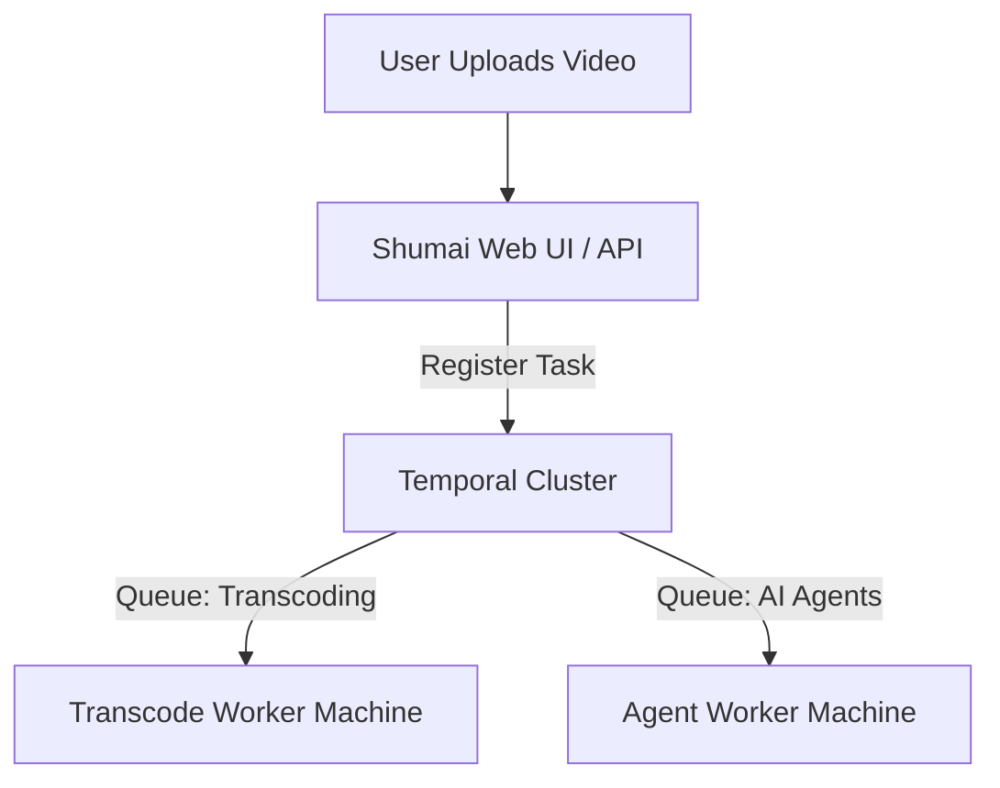

For production environments or workloads with high-volume video processing and heavy AI agent usage, running background tasks on a single server can cause bottlenecks. Shumai resolves this by offloading task queue management, retries, and background executions to **Temporal**.

This allows you to decouple workloads and run specialized worker nodes on separate, dedicated machines.

---

## How it Works

When configured for Temporal, the core Shumai web application does not process background jobs itself. Instead, it publishes tasks to a Temporal Cluster queue.



- **Transcoding Workers**: Can be run on GPU-accelerated or high-CPU compute instances.
- **AI Agent Workers**: Can be run on isolated, sandboxed hosts to safely execute automation scripts.

> [!IMPORTANT]
> **Storage Requirement**: Because the core application and the background workers run on separate machines in a distributed setup, **you must configure an S3-compatible storage backend** (such as AWS S3, Cloudflare R2, or MinIO). Local storage (`STORAGE_BACKEND=local`) is not supported in this mode because the workers and the web application do not share a common filesystem.

---

## Step 1: Deploy the Core Stack

On your primary host machine, spin up the database, Temporal cluster services, and the main Shumai web application:

1.  **Download the Temporal Stack Configuration**:
    ```bash
    curl -o docker-compose.yaml https://raw.githubusercontent.com/shumaiOne/shumai/main/docker-compose/temporal/docker-compose.yaml
    ```
2.  **Configure S3 Settings**:
    Open the `docker-compose.yaml` file and set your S3 credentials and endpoint environment variables under the `shumai` service.
3.  **Start the Services**:
    ```bash
    docker compose up -d
    ```
    This exposes the web application on port `3000`, the database on `5432`, the Temporal gRPC service on `7233`, and the Temporal management dashboard on `8080`.

---

## Step 2: Configure & Run Workers

On your specialized worker machines, you will run the dedicated background worker services. Each worker requires a `.env` file referencing the database, S3 storage, and the Temporal cluster:

```env
DATABASE_URL=postgresql://shumai:shumai_password@<primary-host-ip>:5432/shumai_db?schema=public
WORKFLOW_EXECUTOR=temporal
TEMPORAL_ADDRESS=<primary-host-ip>:7233
STORAGE_BACKEND=s3
AWS_ENDPOINT_URL_S3=https://your-s3-endpoint.com
S3_BUCKET=shumai
S3_REGION=us-east-1
S3_ACCESS_KEY_ID=your-access-key-id
S3_SECRET_ACCESS_KEY=your-secret-access-key
```

### Media Transcoding Worker

Run this on your media processing nodes (requires system installations of `ffmpeg` and `ffprobe`):

```bash
npm install -g @shumai-one/shumai-transcode
shumai-transcode
```

### AI Agent Worker

Run this on your sandboxed agent execution nodes (requires sandbox dependencies like `bubblewrap` or `sandbox-exec`):

```bash
npm install -g @shumai-one/shumai-agent
shumai-agent
```
