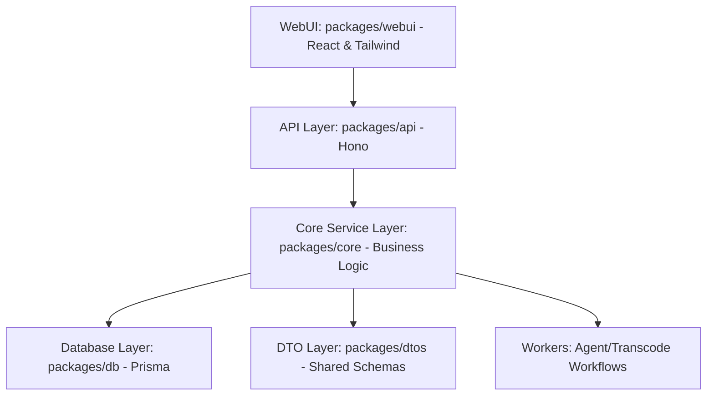

## What is Shumai?

**Shumai** is a highly modular, self-hosted media collaboration platform and AI agent playground. It allows teams to securely store, organize, and review creative assets (video, audio, images, etc.) while leveraging advanced AI capabilities to automate metadata tagging, perform semantic visual searches, and run sandboxed automation scripts.

_Placeholder: Dashboard view showing the file explorer, active projects, and sidebar options._

---

## High-Level Features

- **S3-Compatible & Local FS Storage**: Flexibly store creative assets locally or connect directly to standard S3-compatible providers (AWS S3, Cloudflare R2, MinIO, etc.).
- **Media Commenting & Drawing**: Leave frame-level and timestamped feedback with sketch overlays on image and video assets.
- **Version Stacking**: Version control for assets by stacking multiple file revisions together.
- **AI-Powered Metadata & Search**: Automatically analyze files using Gemini to populate metadata fields, and search them visually or semantically via vector databases.
- **Custom Agent Skills**: Write scripts to automate repetitive workflow actions inside secure sandboxed environments.
- **Production-Ready Media Transcoding**: Offload heavy media processing workloads using distributed workers.

---

## Architectural Layout

Shumai is developed as a modern, strictly decoupled monorepo managed with **Bun Workspaces**. Its architecture ensures clear separations of concerns across the following layers:

### The Monorepo Packages

1.  **WebUI (`packages/webui`)**: The user interface. Built on React and styled with Tailwind CSS and Shadcn UI.
2.  **API (`packages/api`)**: The HTTP server. Built on Hono and Bun. Acts as the entrypoint for all frontend requests.
3.  **Core (`packages/core`)**: The business logic and services layer. Interacts with the database, S3 storage, and external providers.
4.  **Database (`packages/db`)**: Holds the database schema, Prisma client generation, and migrations (using PostgreSQL with `pgvector`).
5.  **DTOs (`packages/dtos`)**: Shared data transfer object definitions and Zod schemas, guaranteeing end-to-end type safety between the frontend and backend.
6.  **Workers**: Specialized packages for running background operations:
    - `@shumai/workflow-core`: Common workflow engine logic.
    - `@shumai/agent`: AI agent workflows and activities.
    - `@shumai/transcode`: Media processing workflows and activities.

---

## Dual Workflow Engines

To cater to different environments, Shumai implements a custom background execution layer that supports two modes:

### 1. Local Executor (Default)

In local development or lightweight self-hosted setups, Shumai uses a polling-based engine. It continuously polls the database for pending background tasks (such as metadata autofill, embedding generation, or transcoding) and executes them directly on the main application container.

### 2. Temporal Executor (Production-Ready)

For heavy production workflows, Shumai decouples background task execution entirely using **Temporal**.

- **Orchestration**: The main Hono application registers tasks to the Temporal Cluster.
- **Specialized Workers**: Separate worker machines run `@shumai/transcode` and `@shumai/agent` processes. They poll tasks from the Temporal queue and execute them independently.
- **S3 Requirement**: In Temporal mode, **you must use an S3-compatible storage backend**. Because workers run on separate machines, they cannot access a local filesystem to retrieve or write files.
