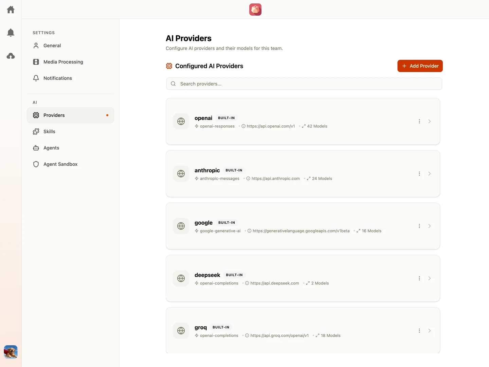

When creating agents for chat or metadata autofill, you must select an underlying AI model. The available models and providers are configured globally within your team settings.

> 🔒 **Access Control:** Only **Team Owner** can manage AI providers. To update these settings, click your avatar, navigate to **Settings**, and select **Providers** from the left sidebar.

---

## Built-In Providers

Shumai ships with pre-configured configurations for major LLM providers. Because Shumai uses [Pi](https://github.com/earendil-works/pi) as its core agent framework, the supported provider and model configurations are automatically synchronized with Pi's capabilities.

Team Owner can freely edit, delete, or add new providers. All configured provider and model settings are injected directly into the Pi framework at runtime.

---

## Configuration Reference

### Provider Settings

When configuring a provider, you will need to specify the following fields:

| Field             | Description                                                                | Example / Notes                                                                                                                  |
| :---------------- | :------------------------------------------------------------------------- | :------------------------------------------------------------------------------------------------------------------------------- |
| **Provider Name** | A unique, human-readable label for the provider.                           | `Ollama-Local`, `Enterprise-Gateway`                                                                                             |
| **Base URL**      | The target API endpoint URL.                                               | `http://localhost:11434/v1`                                                                                                      |
| **API Protocol**  | The streaming and payload implementation format.                           | Most OpenAI-compatible gateways use `openai-completions`.                                                                        |
| **API Key**       | The authentication token. Leave blank for unauthenticated or local setups. | Accepts a literal value (`sk-...`) or an environment variable name (`MY_API_KEY`) to load secrets securely from the host system. |

### Model Settings

Each provider can host multiple models. You can configure the following attributes per model:

| Field                 | Description                                                 | Example / Notes                                    |
| :-------------------- | :---------------------------------------------------------- | :------------------------------------------------- |
| **Model ID**          | The exact identifier string expected by the upstream API.   | `gpt-4o`, `claude-3-5-sonnet-20240620`             |
| **Display Name**      | An optional, friendly label shown to users in dropdowns.    | `GPT-4 Omni`, `Claude 3.5`                         |
| **Reasoning Support** | Toggle to enable extended thinking protocols.               | Use for models with native reasoning capabilities. |
| **Context Window**    | The maximum total token capacity (input + output).          |                                                    |
| **Max Output Tokens** | The hard ceiling for generated response tokens per request. |                                                    |
| **Input Cost**        | Cost tracking specified per million input tokens.           | Optional; used to calculate usage metrics.         |
| **Output Cost**       | Cost tracking specified per million output tokens.          | Optional; used to calculate usage metrics.         |

---

