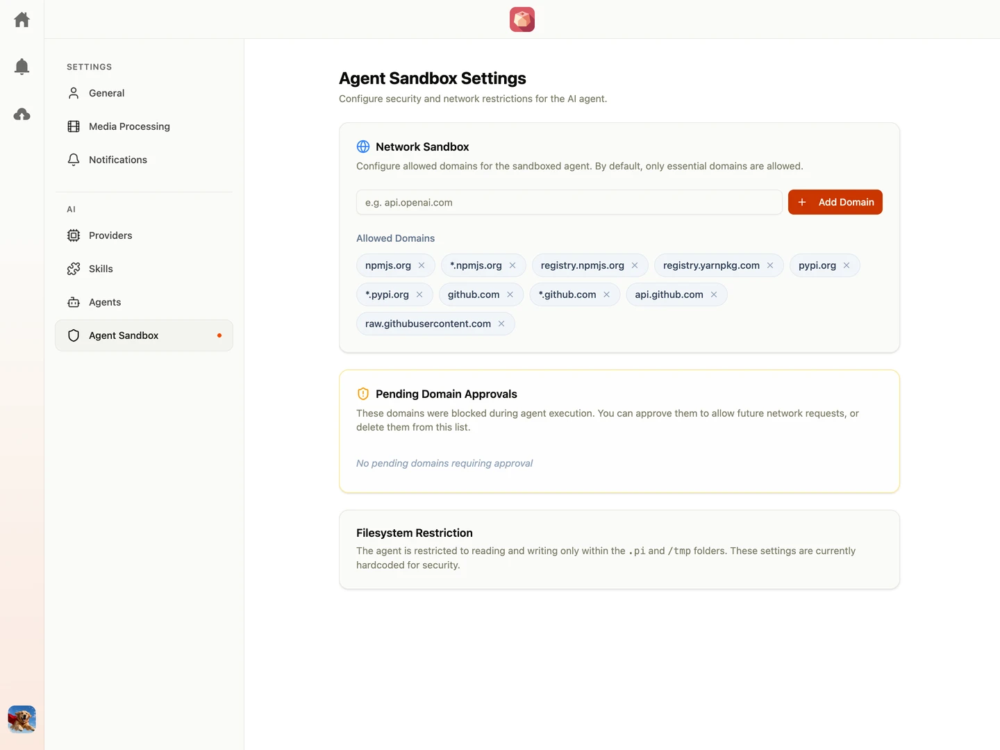

Running automated scripts poses security risks. Shumai resolves this by executing all agent skills inside a secure, isolated **Sandbox** environment.

---

## Sandbox Security

The sandbox restricts the execution process from accessing the host filesystem, system processes, and internal networks:

- **Isolation**: Scripts run in a virtualized workspace container that prevents them from modifying critical system files or reading other project data.
- **Network Bridging**: External network calls from inside the sandbox are strictly monitored.

### File System Restrictions

To protect your workspace environments and sensitive data, the sandbox enforces strict file-level access controls:

- **Read Access**: The sandbox is allowed to read files within the workspace, with a strict exception for sensitive environment and certificate files. It cannot read: `['.env', '.env.*', '*.pem', '*.key']`.
- **Write Access**: The sandbox is heavily restricted and may only write to the `.pi` folder located in the current working directory (cwd). Even within this allowed directory, the sandbox is explicitly blocked from writing or creating sensitive files matching: `['.env', '.env.*', '*.pem', '*.key']`.

---

## Domain Whitelisting

By default, Network Sandbox is **disabled** (allowing all outbound network requests). Team Owners can toggle Network Sandbox **ON** in Sandbox Settings to enforce strict domain whitelisting:

### Allowed Domains

A list of domains that sandboxed scripts are permitted to access.

- Default whitelisted domains include standard package registries (like npm or python package hosts) and repository hosts (like `github.com`).
- If a script needs to call an external API (e.g. `api.slack.com`), the administrator must add it to the allowed list.

### Pending Domains

When an agent script attempts to reach a domain that is not currently authorized:

1.  The network connection is blocked immediately.
2.  The target domain is logged and added to the **Pending Domains** list.
3.  Admins can review this list and click **Approve** to authorize the domain, or **Reject** to keep it blocked.

