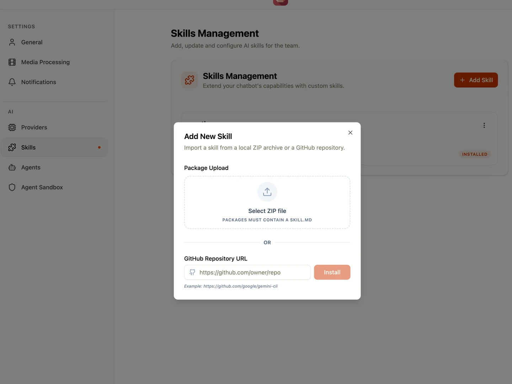

By default, AI models can only process text and image. In Shumai, you can extend both your **Chat Agents** and **Autofill Agents'** capabilities by registering **Skills**—custom scripts that the agent can run when solving a task.

---

## How Skills Work

Skills are actions that you define and make available to your AI agents.

- **Descriptions for the AI**: When you register a skill, the AI agent reads its metadata to understand exactly when and how it should use the tool to solve a problem.
- **Execution & Local Caching**: When an agent decides it needs to use a skill, Shumai handles the execution. Newly added skill data is synced to the database first. Upon execution, the agent downloads and caches the skill locally from the database for fast, reliable access.

---

## Adding a Skill

To install a new skill into Shumai:

1. Navigate to the **Settings** page and open the **Skills** tab.
2. Click the **Add Skill** button.
3. In the dialog box, choose your installation method:
   - **Upload**: Select and upload a `.zip` file containing your skill.
   - **GitHub**: Provide a valid GitHub repository path.

> **Important:** Regardless of the installation method, the root folder of the skill must contain a `SKILL.md` file.

### Updating an Existing Skill

To update a skill, simply follow the steps above and install the new version using the exact same skill name. Shumai will automatically replace the older version.

---

## Configuring Environment Variables

If your custom skill requires environment variables (e.g., API keys, external tokens) to function:

1. Click on the installed **Skill Card** in the Skills tab to open the configuration dialog.
2. Add the required environment variables.
3. _(Optional)_ Set a default value for the variable. If no default value is provided, the skill will dynamically load the required value from the system environment at runtime.

---

## Enabling Skills for Agents

**All skills are disabled by default.** Merely installing a skill does not give agents access to it. To allow an agent to use an installed skill:

1. Navigate to your specific **Agent Settings**.
2. Explicitly enable the skills you want to authorize for that particular agent.

