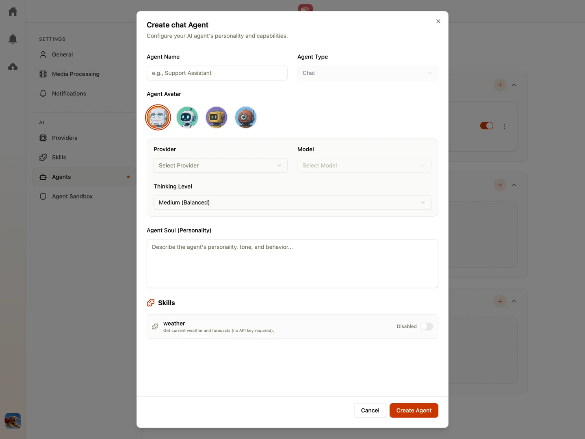

Shumai uses specialized AI Agents to perform background automation, chat workflows, and semantic indexing. **Only Team Owner** can create, manage, and change agent settings.

---

## Agent Types

Shumai supports three types of agents:

### 1. Chat Agent

An interactive, conversational bot that appears in your project workspace.

- You can create as many chat agents as you want.
- You can use "@" to mention chat agents directly in file comments.
- The agent is context-aware: it can read files, search the project folder, inspect metadata, and read comment threads.
- You can add "Skills" to a chat agent, enabling it to write files, run scripts, or interact with external APIs on your behalf.

### 2. Autofill Agent

A background agent that monitors file uploads. You can create **only one** Autofill Agent.

- Once created and enabled, Shumai automatically triggers the agent when a new file is uploaded, provided the file type is supported (image or video).
- It analyzes the file's content (multimodal images, text descriptions) and populates any metadata fields flagged for "AI Autofill".

### 3. Embedding Agent

A specialized utility agent that processes assets to generate search indexes. You can create **only one** Embedding Agent.

- Once created and enabled, Shumai automatically runs embedding generation for new file uploads if the file type is supported (image or video).
- These search indexes are saved to power Shumai's natural language semantic search capabilities.
- **Note:** The Embedding Agent is hardcoded to use `google-embedding-2` as the LLM model. Because of this, you cannot choose a provider or model. Make sure you set the `GEMINI_API_KEY` environment variable to make it work.

---

## Configuring an Agent

To edit or create an agent, navigate to **Team Settings** > **Agents** (Note: Only Team Owners can change these settings):

- **Avatar**: Choose an avatar for the agent by picking from the predefined avatars.
- **Enabled / Disabled Toggle**: Stop or start the agent. If the embedding agent is disabled, semantic search indexing is paused.
- **System Prompt / Soul**: The core instructions that define the agent's behavior, guidelines, formatting requirements, and operational limits.
- **Model Provider**: Select which registered provider and model the agent should use for execution. _(Note: This option is disabled for Embedding Agents)._
- **Assigned Skills**: Select which custom skills this agent is permitted to execute.

