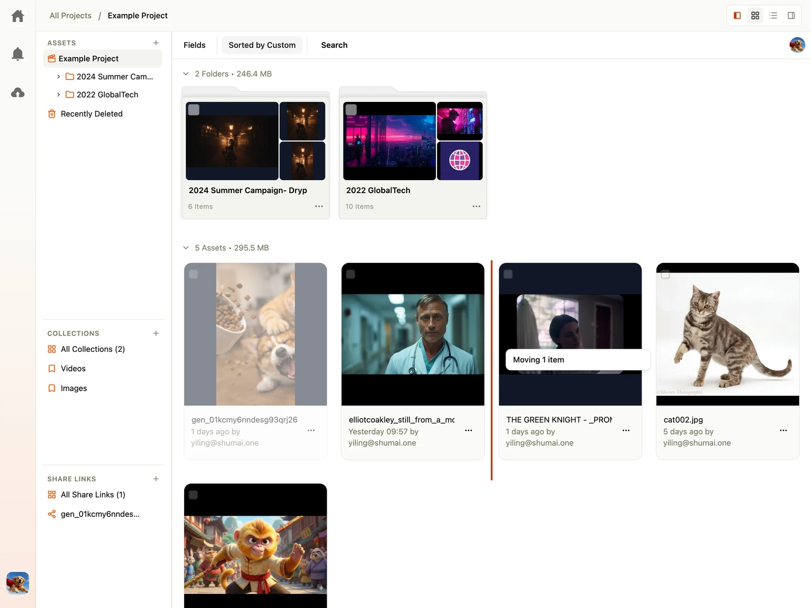

Shumai makes it easy to bring creative media into your workspace, organize them in folders, and manage their lifecycle from upload to deletion.

---

## Uploading Assets

You can upload files and folders into Shumai using three methods:

1.  **Drag and Drop**: Drag files or entire folder directories directly from your computer's file explorer and drop them anywhere on the Shumai dashboard interface.
2.  **Upload Buttons**: Click the **Upload File** or **Upload Folder** buttons in the toolbar.
3.  **Copy and Paste**: Copy an image or file from another website, application, or your clipboard, and paste it directly (`Ctrl+V` or `Cmd+V`) into the Shumai browser window to upload it instantly.

---

## Folder Organization

When you upload an entire folder, Shumai replicates your folder hierarchy exactly inside the project.

- All subfolders are created automatically.
- Nested files remain in their respective subfolders.
- There is no limit to the depth of nested folders you can upload.

---

## Upload and Processing States

Once an upload starts, your assets progress through the following states:

- **Uploading**: The file is transferring to your storage server. The UI displays an active progress percentage.
- **Processing**: The file has successfully uploaded. Shumai is now extracting media parameters (such as resolution, video length, and audio codecs) and creating a web-friendly streaming preview (proxy).
- **Ready**: Processing is complete. The asset is fully visible, playable, and ready for comments, metadata tagging, or search.

---

## Deleting and Restoring Assets

If you no longer need an asset, you can delete it to clean up your workspace:

### The Trash Bin (Recently Deleted)

- When you delete a file or folder, it is moved to the **Recently Deleted** tab in your project settings.
- Deleted assets are kept in the Trash for **30 days**. During this window, you can select any asset and click **Recover** to restore it to its original location.
- If you want to free up space immediately, you can open the Recently Deleted tab and click **Empty Trash** to permanently purge the files.

### Permanent Removal

After **30 days** in the Trash, assets are automatically and permanently purged. Once purged, the records are removed from the database, and the files are deleted from your storage backend (local file system or S3 bucket) and cannot be recovered.
