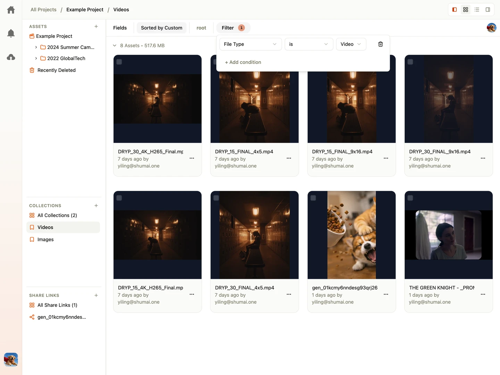

Instead of copying files into static folders, Shumai uses **Collections**—dynamic, query-based virtual views. A collection automatically groups files that match specific criteria in real-time.

---

## What is a Collection?

A **Collection** does not duplicate files on disk. Instead, it runs a pre-defined filter query against your project assets database. Whenever a new file is uploaded or metadata is updated to match the collection's query, the file automatically appears inside the collection.

---

## Creating a Collection

You can create collections in two ways:

- **From the Sidebar**: Click the `+` icon next to **Collections** in the project sidebar to open the query builder, configure your search rules, and save it.
- **From the Search Dialog**: When searching and filtering files within the Search Dialog, you can save your active search criteria by clicking the **Save as collection** button at the bottom of the dialog. This will create a dynamic collection that mirrors your search filters.

---

## Setting Up Collection Filters

When creating or editing a collection, you specify a name and set up a filter query in the builder interface:

### 1. Source Folder

Specify the starting folder directory. The collection will scan this folder and all its nested subfolders recursively.

### 2. Operators and Conditions

- **Logical Operators**: Combine conditions using **AND** (all conditions must be met) or **OR** (at least one condition must be met).
- **Fields**: Filter on standard fields (name, type, size) or custom metadata fields (such as "Status" or "Approval").
- **Comparison Rules**:
  - _Equals / Does Not Equal_: Match exact values.
  - _Contains / Does Not Contain_: Match parts of words.
  - _Greater Than / Less Than_: Set up numeric or date ranges (e.g., date uploaded is after yesterday).
  - _Is Empty / Is Not Empty_: Check if fields have values.

### 3. Collection Default Sorting

Define a custom sorting rule specific to the collection (e.g., sort by the custom field "Publication Date" ascending) to override the default project sort order.

---

## Example Use Cases

- **Review Dashboard**: A collection named "Pending Review" that displays assets where `Status` equals `In Review`.
- **Daily Deliverables**: A collection filtering files uploaded in the last 24 hours.
- **Approved Assets**: A collection filtering assets matching `Tag` contains `marketing` AND `Approved` is `Yes`.

