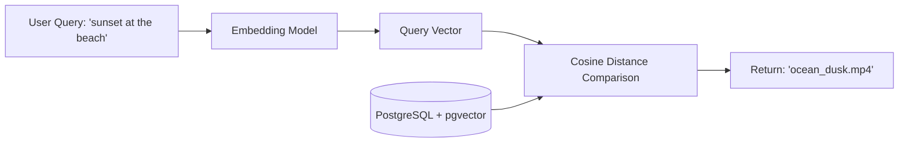

Traditional search relies on matching exact characters (e.g., searching "dog" will not find files named "golden_retriever.jpg"). Shumai resolves this with **Semantic Search**, which indexes the conceptual meaning of your files.

---

## How Semantic Search Works

Semantic search translates text and media into high-dimensional numerical vectors (embeddings) where similar concepts sit close to each other.

1.  **Ingestion**: When an asset is uploaded and processed, the **Embedding Agent** converts the file's description, text, or visual tags into a 1536-dimensional vector.
2.  **Storage**: These vectors are stored in the `asset_embeddings` table in PostgreSQL, utilizing the **`pgvector`** extension for indexing.
3.  **Querying**: When you search with the "Semantic" toggle enabled, Shumai converts your search query into a vector and queries the database for the closest vector matches using cosine distance.

---

## Setting Up Semantic Search

To activate semantic search in your team workspace:

1.  Navigate to **Team Settings** > **Agents**.
2.  Verify that you have created an **Embedding Agent** (`type` set to `embedding`) and it is toggled **Enabled**.
3.  Ensure the agent is linked to a valid embedding model (e.g., `text-embedding-3-small` from OpenAI, or a supported Google Gemini embedding endpoint).
4.  Once the agent is active, Shumai will automatically begin indexing new uploads, and the **Semantic Search** toggle will appear on your file search explorer.

_Placeholder: Screenshot of the search bar, emphasizing the active "Semantic" toggle option next to the text input._
