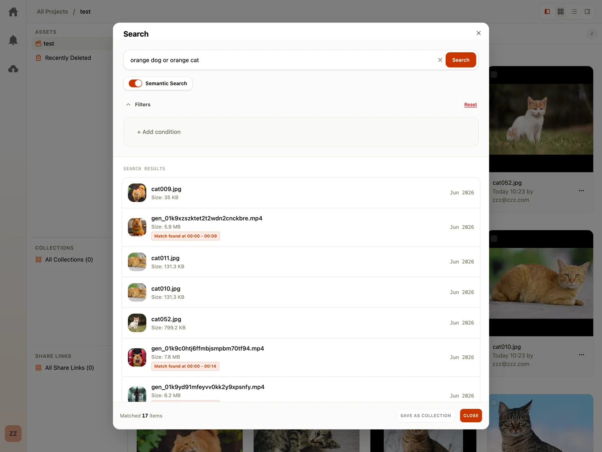

Traditional search relies on matching exact characters (e.g., searching "dog" will not find files named "golden_retriever.jpg"). Shumai resolves this with **Semantic Search**, which indexes the conceptual meaning of your files.

---

## How Semantic Search Works

Semantic search translates text queries and file contents into conceptual profiles. Similar ideas and visuals are mapped near each other.

1.  **Index Generation**: When you upload an asset, Shumai's background agent scans the file's visual elements, text contents, or descriptions, translating them into a concept profile.
2.  **Concept Matching**: When you search with the "Semantic" toggle enabled, Shumai matches the conceptual meaning of your query against your assets.
3.  **Result**: Searching "sunset at the beach" will successfully find a video file of ocean waves at dusk, even if the filename is `IMG_4029.mp4`.

---

## Activating Semantic Search

To use semantic search:

1.  Verify that your administrator has enabled the **Embedding Agent** under **Team Settings** > **Agents**.
2.  Once active, Shumai will automatically begin indexing new uploads.
3.  Toggle the **Semantic** button next to the search input in the file explorer to search by conceptual meaning.

