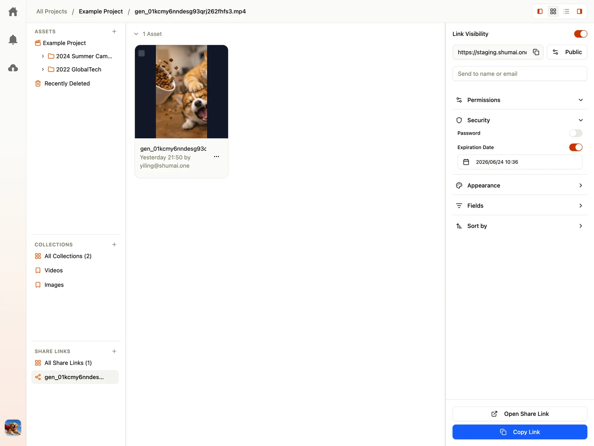

Shumai allows you to collaborate with external stakeholders who do not have accounts in your workspace. Using **Share Links**, you can grant view and comment access to specific folders or assets.

---

## Creating a Share Link

1. Select the files or folders you want to share, then right-click and choose **Create New Share Link**.
2. Click the newly created **Share Link** in the project sidebar to open its settings page.
3. Configure the share link in the right sidebar. You can:
   - Add password protection
   - Set an expiration date
   - Configure which metadata fields are visible to recipients
4. Click **Copy Link** at the bottom of the sidebar, then send the link to your client or stakeholder.

---

## Adding Assets to an Existing Share Link

Once a share link is created, you can easily add more files or folders to it without generating a new link:

1. Select the files or folders you want to add from your file browser.
2. Drag and drop them directly onto the share link item in the project sidebar.
3. The share link will immediately update to include the newly added assets.

---

## Security and Settings

### Expiration Date

Set an optional date and time after which the link becomes inactive. Once the date passes, the link returns a `404 Not Found` page to anyone attempting to access it.

### Password Protection

Secure sensitive work by adding a password. External users visiting the link will be prompted to enter the correct password before they can view the assets.

### Default Sort Order

Set a default sorting rule for the shared page (e.g. sorting by name or version) to ensure the client views the files in the intended order.

### Column Visibility

To protect proprietary information, you can configure exactly which metadata columns are visible to external users. For example:

- **Visible**: `Asset Name`, `Resolution`, `Download Link`.
- **Hidden**: `Internal Budget Code`, `Assignee Notes`, `Cost`.

### Disabling a Link

If you need to revoke access immediately, navigate to the **Share Links** tab under Project settings and toggle the **Disabled** switch. You can re-enable the link at any time.
