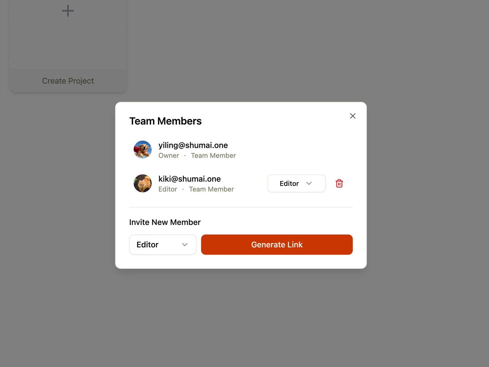

Shumai uses a two-tier organizational hierarchy—**Teams** and **Projects**—to manage file access and collaboration.

---

## Member Visibility & Scopes

Members added to a team belong to one of two permission scopes:

- **Team Scope**: Team-scoped members can view all projects inside the team by default.
- **Project Scope**: Project-scoped members can only see and access the specific projects they have been explicitly granted permission to join.

---

## Member Roles

Shumai uses permission roles to control what actions team and project members can perform:

- **Owner**: Full administrative control. Team Owners can modify team settings, skills, and AI providers. Project Owners can edit project configurations, manage members, and generate invites.
- **Editor**: Can upload files, edit custom metadata, create folders, and add comments or canvas annotations.
- **Reviewer**: Read-only access. Can view media assets, toggle versions, and leave text comments or canvas drawings, but cannot upload/delete files or modify metadata.

---

## Project Role Overrides

Administrators can add existing team members to specific projects to override their permissions:

- Project-level roles take higher priority than team-level roles within that project.
- _Example_: If Peter is a team member with an **Editor** role, an administrator can add Peter to _Project A_ with a **Reviewer** role. Peter will act as a Reviewer inside Project A, but maintain his Editor role across the rest of the team's projects.

---

## Managing Members

Member management is handled using a unified **Members Dialog** popup:

### 1. Managing Team Members

- **Access**: Open your **Team Dashboard** and click the members list or avatar group in the header.
- **Settings**:
  - Change member roles between Editor and Reviewer.
  - Remove members from the team.
  - **Invite New Members**: Select a role (Editor or Reviewer) and click **Generate Link**. Copy the signup URL to invite new users to the team.

### 2. Managing Project Members

- **Access**: Open your project **File Browser** and click the members avatars or button in the top toolbar.
- **Settings**:
  - Change project member roles or remove them from the project.
  - **Add Team Members**: The dialog displays a list of active team members who are not yet added to this project. Select their project role (which will override their team role inside this project) and click **Add** to add them instantly.
  - **Invite External Collaborators**: Select a role (Editor or Reviewer) and click **Generate Link** to invite new users directly into this specific project.

