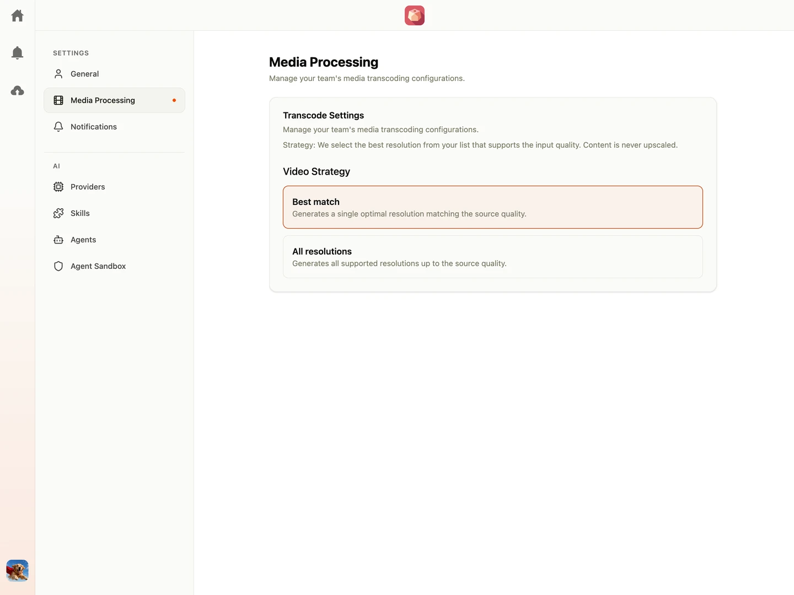

High-resolution camera formats and raw media files cannot be rendered natively in web browsers. Shumai transcodes video assets into web-friendly streaming and preview formats in the background.

Team Owners can customize video transcoding behavior from the **Team Settings > Video Transcoding** page.

Regardless of the selected transcoding strategy, Shumai's pipeline will **always** generate at least one lightweight `180p` proxy version of the raw file to ensure fast scrubbing, thumbnail generation, and instant previews.

---

## Transcode Policy

The **Transcode Policy** card configures both MP4 video transcoding and HLS adaptive streaming.

### Playback and Download Behavior

Shumai uses a dual-format strategy for video delivery:

- **When HLS is disabled**: Both in-browser video playback and file downloads will use the generated MP4 file(s).
- **When HLS is enabled**: In-browser video playback uses HLS (HTTP Live Streaming) for smooth, adaptive bitrate playback, while file downloads will use the generated MP4 file(s).

<Warning>
  **Storage Usage Notice**: Enabling HLS generates multi-bitrate segment files (`.ts` / `.m4s`) and
  playlist manifests in addition to standard MP4 proxies. This can significantly increase storage
  consumption on your storage bucket.
</Warning>

### MP4 Video Strategy

Team Owners can select how MP4 transcodes are generated for uploaded files:

#### 1. Best Match

- **Behavior**: Shumai checks the longest dimension of the uploaded video and generates a single optimal resolution matching or smaller than the source quality, preventing unnecessary upscaling.
- **Output**: Generates the lightweight `180p` proxy and the calculated best-match MP4 file.
- **Use Case**: Recommended default. Minimizes processing time and storage space while ensuring universal playback and download compatibility.

#### 2. Multi Resolutions

- **Behavior**: Select specific target resolution ladders to generate: `480p`, `720p`, `1080p`, `1440p`, and `2160p`. Resolutions are only generated up to the source video resolution (content is never upscaled).
- **Output**: Generates the `180p` proxy plus all selected resolution ladders that do not exceed the source resolution.
- **Use Case**: Ideal when users need to download multiple specific resolutions (e.g. 720p for fast sharing and 1080p for review).

### HLS Streaming

When **HLS Streaming** is toggled on, Shumai produces an adaptive bitrate HLS package for uploaded videos:

- **Resolution Ladders**: Configure which resolutions to generate for HLS streaming (`480p`, `720p`, `1080p`, `1440p`, `2160p`). Ladders are only generated up to the original video resolution.
- **Player Integration**: The web player will automatically stream via HLS when available, dynamically switching bitrates based on client network bandwidth.

---

## Hardware Acceleration

To offload encoding workloads from CPUs to GPUs, Shumai supports hardware-accelerated video encoding:

- **Disabled (Software)**: Uses the standard CPU `libx264` software encoder with Constant Rate Factor (CRF).
- **Auto Detect**: Automatically probes and leverages available GPU/hardware acceleration (NVIDIA NVENC, Intel QuickSync, AMD/Intel VA-API, Apple VideoToolbox, Rockchip RKMPP).

See the [Hardware Transcoding Guide](/configuration/hardware-transcoding) for Docker Compose configuration, GPU passthrough, and driver prerequisites.

---

## FFmpeg Threads

The **FFmpeg Threads** slider controls the maximum number of CPU threads used by FFmpeg during transcoding tasks:

- **Auto (0)**: FFmpeg automatically selects the optimal thread count based on host CPU core availability.
- **Manual (1 - 32)**: Restricts FFmpeg to a fixed number of threads, useful for throttling CPU consumption on shared worker nodes.

---

## Processing Architecture

Transcoding is resource-intensive. Depending on your scaling needs, your administrator can run the transcode engine on the main server (Single-Server mode) or delegate tasks to specialized transcoding worker machines (Temporal Worker mode).

In all modes, the processing machine must have system media utilities (`ffmpeg` and `ffprobe`) installed. See the [Temporal Deployment Guide](/configuration/temporal) for setting up distributed transcoding workers.
